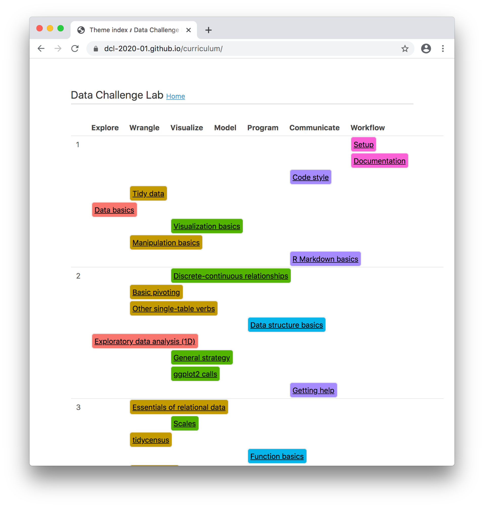

class: middle, title

# Using R to teach R
## Sara Altman

## Slides: [http://skaltman.github.io/rstudio-conf-2020](http://skaltman.github.io/rstudio-conf-2020)
## Open materials: [dcl-docs.stanford.edu](dcl-docs.stanford.edu)
---
class: center, middle

```{r setup, include=FALSE}
options(htmltools.dir.version = FALSE)
library(tidyverse)
```

# Using R to teach R

## Data Challenge Lab

```{r echo=FALSE}
knitr::include_graphics("images/hex.png", dpi = 4000)
```

---
class: center, middle

## Alongside Bill Behrman and Hadley Wickham, I co-teach a class at Stanford called the Data Challenge Lab (DCL). 

---

# The DCL is...


## A skills-based introductory data science class. `r emo::ji("computer")`

--

## For students of all academic backgrounds, sophomores to PhDs. `r emo::ji("woman_student")`

--

## Centered around the tidyverse, data visualization, and exploratory data analysis. 

---
class: center, middle

# What do you mean by skills-based?

---

## We focus on realistic practice designed to build foundational data science skills. 

--

## There is (almost) no lecturing. 

--

## Students spend class time working on assignments and projects, asking questions, and reviewing feedback.

---
class: center, middle

# What kinds of projects?

---

### We try to create assignments that simulate real work.

### We often start by recreating work that expert data journalists, social scientists, data scientists, and others have already done.

--

```{r echo=FALSE, out.width='100%'}

```


---

## Students explore voter behavior in the 2016 election, global migration patterns, and the opioid epidemic (among many other topics).

--

```{r echo=FALSE, include=FALSE}
gm_combined_paired <-
  dcldata::gm_combined %>% 
  filter(year %in% c(2010, 2015)) %>% 
  select(iso_a3, name, region, year, life_expectancy) %>% 
  pivot_wider(
    names_from = year,
    names_prefix = "year_",
    values_from = life_expectancy
  )

outliers <-
  gm_combined_paired %>% 
  mutate(diff = year_2015 - year_2010) %>% 
  filter(diff < -0.5 | diff > 5)

gm_combined_paired %>% 
  ggplot(aes(year_2010, year_2015)) +
  geom_point(aes(color = region), alpha = 0.5) +
  geom_abline(slope = 1, intercept = 0, color = "red") +
  ggrepel::geom_text_repel(aes(label = name), nudge_x = -5, data = outliers) +
  annotate(
    geom = "text", 
    x = c(30, 65), 
    y = c(85, 50), 
    label = c("Life expectancy increased", "Life expectancy decreased"), 
    hjust = 0
  ) +
  coord_fixed() +
  labs(
    x = "Life expectancy, 2010", 
    y = "Life expectancy, 2015", 
    color = "Region",
    caption = "Source: Gapminder"
  )

ggsave("images/life-expectancy.png")
```

--

```{r echo=FALSE}

```

---
class: center, middle

# Using R to teach R
## Gathering feedback 
# `r emo::ji("woman_farmer")`

---

# DCL students provide (daily!) feedback on all course materials

```{r echo=FALSE, out.width='80%'}

```


---

# We monitor that feedback to adjust the class in real time.

```{r echo=FALSE, out.width='70%'}

```

---

# We also use the entire quarter's feedback to improve the class for the next offering.

```{r echo=FALSE, out.width='80%'}

```

---

class: center, middle

# Using R to teach R
## Open, evolving content
# `r emo::ji("book")`

---

# Our curriculum updates and changes every quarter.

.pull-left[
```{r echo=FALSE, out.width='80%'}

```

]

.pull-right[

## [https://dcl-2020-01.github.io/curriculum/](https://dcl-2020-01.github.io/curriculum/)

### We track each of our 30+ unit's dependencies and skills with yaml.
]

---

# We create open content for learning and teaching data science.

.pull-left[

```{r echo=FALSE}
knitr::include_graphics("images/open-content.png")
```


]

.pull-right[

## [dcl-docs.stanford.edu](dcl-docs.stanford.edu)

### We use bookdown to collect our content into books.

]

---
class: center, middle

# Using R to teach R
## Tools for students and teachers

# `r emo::ji("package")`

---

# Easy U.S. boundaries with ussf

## ussf package: https://github.com/dcl-docs/ussf

### Albers equal area, plus scaled Alaska and Hawaii 

.pull-left[

```{r eval=FALSE, fig.height=2, fig.align='center'}
# remotes::install_github("dcl-docs/ussf")
ussf::boundaries(geography = "state") %>% 
  ggplot() +
  geom_sf() +
  theme_void()
```

]

.pull-right[

```{r echo=FALSE, fig.height=4, fig.align='center'}
ussf::boundaries(geography = "state") %>% 
  ggplot() +
  geom_sf() +
  theme_void()
```

]

---

# Encourage good workflow habits with a function

## dcl package: https://github.com/stanford-datalab/dcl
### Create a project from a template repository, or use our default

.pull-left[

```{r eval=FALSE}
dcl::create_data_project(
  path = "groundbreaking-project"
)
```

]

.pull-right[

```{r echo=FALSE, out.width='55%', fig.align='center'}
knitr::include_graphics("images/create_data_project.png")
```

]

---

# Follow along with dcldata

## dcldata package: https://github.com/dcl-docs/dcldata

### All datasets from our books are collected in dcldata, so students can easily the run code themselves.

```{r}
dcldata::congress %>% 
  head()
```


---
class: middle

# Using R to teach R
## Sara Altman
## Slides: [skaltman.github.io/rstudio-conf-2020](http://skaltman.github.io/rstudio-conf-2020)
## Open content: [dcl-docs.stanford.edu](dcl-docs.stanford.edu)

### Thanks to Bill Behrman and all DCL students 


