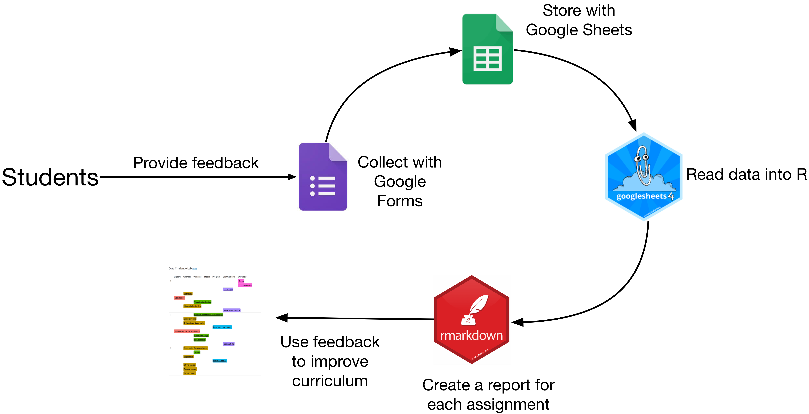
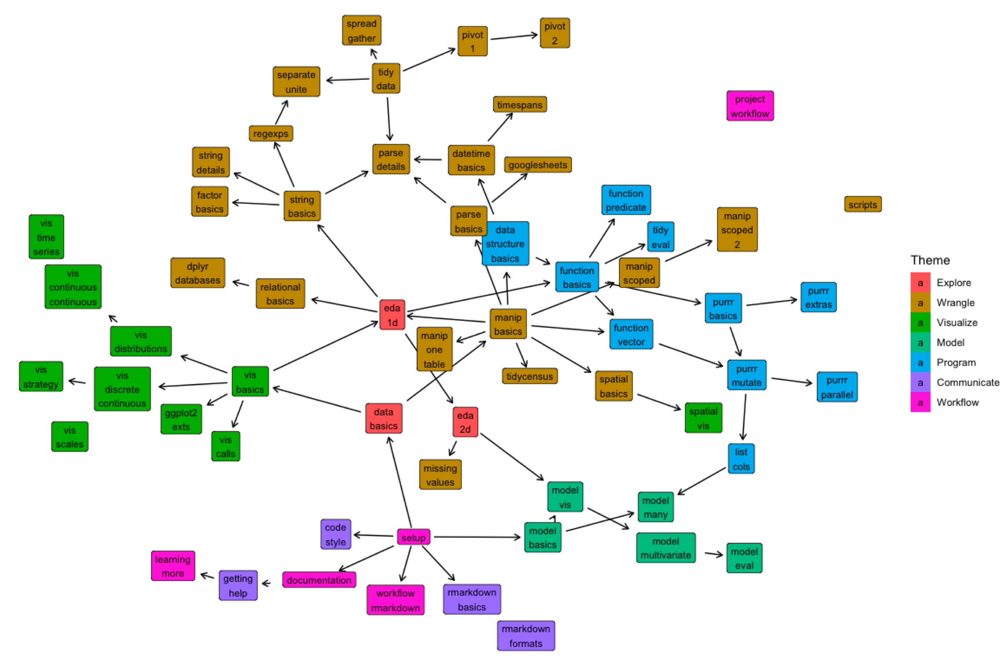

class: center, middle

```{r setup, include=FALSE}
options(htmltools.dir.version = FALSE)
library(tidyverse)
```

---
## Data Challenge Lab

.pull-left[

### Taught at Stanford

### Created by Bill Behrman and Hadley Wickham

]

.pull-right[

### Skills-based, intro data science class

### Data visualization, EDA, modeling, all in R

### Students of all academic backgrounds, sophomores to PhDs

]


---

# Content

.pull-left[
  
  ## Curriculum
  
  

* Current curriculum
* 30+ individual units, woven in with larger projects

]

.pull-right[

  ## Open content
  
  
  
    [DCL open content](dcl-docs.stanford.edu)
    [dcl-docs.stanford.edu](dcl-docs.stanford.edu)
    
    * We use bookdown to collect our content into books`r emo::ji("book")`
    * Data visualization, data science workflow, functional programming, basic modeling
    
]


---

# Feedback



Students provide feedback on everything with do--every exercise, project, and reading.

We use this feedback to improve the class while it's happening, as well as for the next course offering.

---

# Tools for students (and teachers)

#### Easy boundaries `r emo::ji("world_map")`

[ussf package](https://github.com/dcl-docs/ussf)

* Easy access to U.S. boundaries for states, counties, and commuting zones
* Albers equal area, plus scaled Alaska and Hawaii 

```{r}
# remotes::install_github("dcl-docs/ussf")
ussf::boundaries(geography = "state") %>% 
  ggplot() +
  geom_sf() +
  theme_void()
```

---

# Tools for students (and teachers)

## Project template

[dcl package](https://github.com/stanford-datalab/dcl)

* Create a project structure from a template
* Pass in a repo to use as a template, or use the default

```{r eval=FALSE}
# remotes::install_github("stanford-datalab/dcl")
dcl::create_data_project(path = "groundbreaking-project")
```

.pull-left[

```{r echo=FALSE}
knitr::include_graphics("images/create_data_project.png", dpi = 250)
```

]

.pull-right[

```{r echo=FALSE}
knitr::include_graphics("images/folder-organization.png", dpi = 200)
```
]

---

## Skill dependencies


```{r echo=FALSE}

```

We track dependencies for every unit, using yaml.

---

## Skill dependencies


```{r echo=FALSE}
knitr::include_graphics("images/skills-yml.png")
```

Each assignment has it's own yml file, keeping track of the skills required to do the assignment and the skills the assignment develops.

We have over 80 assignments, and are constantly adding, replacing, and updating. We needed a way to keep track of dependencies so that we could order them in a way that made sense.

---

## Student progress

screenshot of dashboard

---


